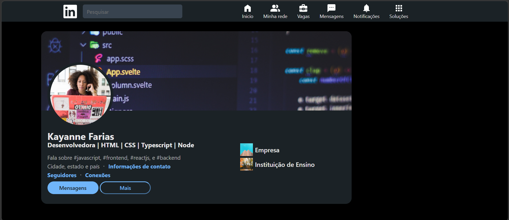

# LinkedIn Clone — 7 Days of HTML & CSS

Clone estático da interface de perfil do LinkedIn, desenvolvido durante o desafio **7 Days of HTML e CSS**.

## 🖥️ Preview



## ✅ Páginas e seções desenvolvidas

- [x] Header com navegação e busca
- [x] Seção de perfil com foto de capa e avatar
- [x] Destaques
- [x] Atividades
- [ ] Sobre
- [ ] Experiências
- [ ] Formação acadêmica
- [ ] Idiomas
- [ ] Sidebar — pessoas que também viram
- [ ] Sidebar — pessoas que talvez você conheça

## 🚀 Tecnologias utilizadas

- HTML5 semântico
- CSS3 — Flexbox, Grid e variáveis CSS

## 📚 O que pratiquei

- Estrutura semântica com `header`, `main`, `aside`, `article` e `section`
- Posicionamento com `position: relative` e `absolute`
- Sobreposição de imagens (foto de perfil sobre a capa)
- Unidades de medida `rem`, `vh` e `%`
- Versionamento com Git e autenticação SSH

## 🎨 Protótipo

Desenvolvido com base neste [protótipo no Figma](https://www.figma.com/design/YNrQbgrdCBM7tDd6CfpBmm/7days---HTML-e-CSS--Linkedin-)

## 🔗 Como visualizar

```bash
git clone git@github.com:kayanne/nome-do-repositorio.git
```

Abra o arquivo `index.html` no navegador.

## 👩‍💻 Autora

Kayanne Farias  
[LinkedIn](https://linkedin.com/in/seu-perfil) • [GitHub](https://github.com/kayanne)
